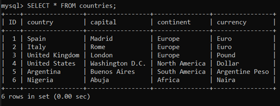
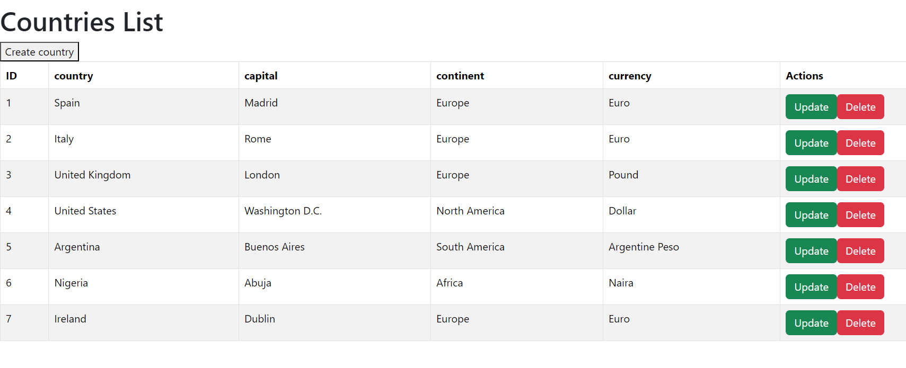

# Web services and applications-Project
This repository is part of the module of the same name of the HDip in Data Analysis of ATU Galway and contains the final project.  

The project is an example of a Country List application implemented using Python and Flask for the server side (backend) and HTML for the user interface (frontend).  

The SQL database uses the following table:

  

This project is based on the Books example described in the course notes.
To see the original material, access the following link: 
https://github.com/andrewbeattycourseware/wsaa-course-material

***  

## How to use this repository:

1) Install latest version of Anaconda(at the time of this project the version is 2.4.0.)
2) Install the latest version of Visual Studio Code(at the time of writing this project the version is 1.88.1)
3) Clone the repository at https://github.com/jalaca91/WSSA-Project
4) Open the repository in Visual Studio Code or another IDE of your choice.
5) Run using Python interpreter version 3.10.13

## This repository contains the following:

1) A `images` file containing images of what the database called ‘countries’ looks like and what the created web page looks like
2) A `.gitignore` file with python template
3) A `readme file` containing the description of the project and its content, as well as other aspects of interest
4) A `countryViewer.html`  which contains the interface and AJAX requests required to perform CRUD (Create,Read,Update,Delete) operations on the countries website
5) A `countryDAO.py` to provide an abstract interface for interacting with the sql database
6) A Python file entitled `country_server.py` which runs the Flask server created for the project.
7) A `dbconfig.py` that seves as link server to database
8) A `countries_db.sql` file which contains the SQL database

## Project functionality and description

The main goal of this project is to create a server application on Flask that has a RESTful API.  
The application links to database tables and throuhg web pages performs CRUD operations on the data. 

The application view is as follows:

The operations that can be carried out are:

1) Create a new country entry (Create) 
2) View a list of countries (Read)
3) Update an existing country entry (Update)
4) Delete a country entry (Delete)

In short, and to recapitulate, the technologies used are: 
* A Flask server
* REST API (to perform CRUD operations)
* One SQL database
* A web interface using html/javascript
* AJAX calls to perform CRUD operations.

